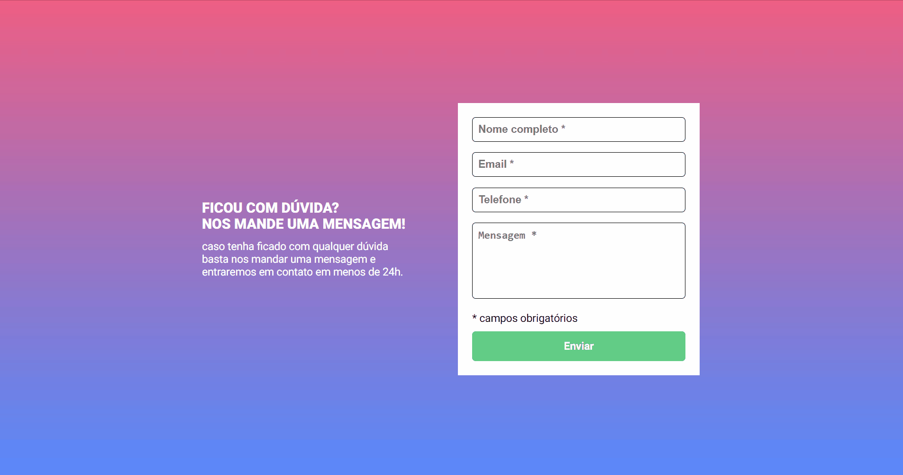
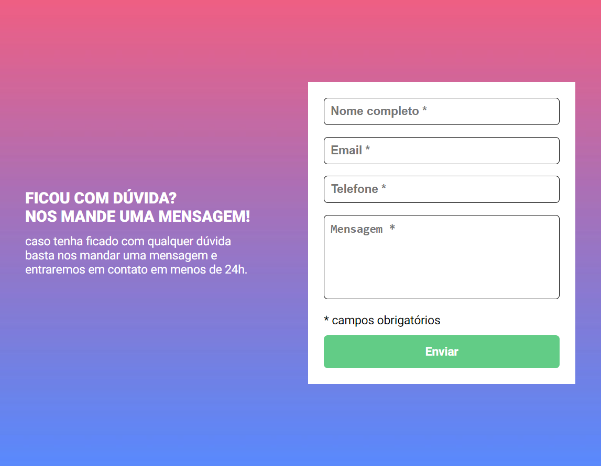
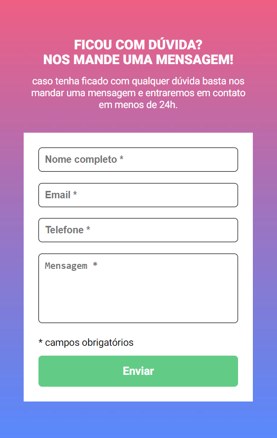

<h1>Contact form with validation in JS</h1>

 This is a responsive contact form I coded in response to a challenge by DevQuest by <a href="https://github.com/devemdobro" target="_blank">Dev em Dobro</a>. The challenge is intended for intermediate JS practicing, as well as HTML and JS practicing. Design was provided in a Figma project. 

<h2>Overview</h2>

<h3>The project</h3>

The project is a contact form. Form validation should be done with JS only. When user clicks in the submit button, a red message should appear under any mandatory input that is not filled and its border should turn red. Filled inputs should have its border turned green.
 

<h3>Screen preview</h3>
<h4>Desktop</h4>

<h4>Tablet</h4>

<h4>Mobile</h4>

<h3>Links</h3>
<ul>
    <li>Live site URL: <a href="https://julianastahelin.github.io/contact-form-js-exercise/">https://julianastahelin.github.io/contact-form-js-exercise/</a></li>
</ul>

<h2>My process</h2>

<h3>Built with 👩🏽‍💻</h3> 
<ul>
    <li>HTML 5;</li>
    <li>CSS 3;</li>
    <li>JavaScript.
</ul>

<h3>What I practiced 💪🏽</h3>
<ul>
    <li>Form validation with JS;</li>
    <li>Using forEach loop in JS;</li>
    <li>Styling form inputs;</li>
    <li>Using CSS media queries for responsiveness.</li>
</ul>

